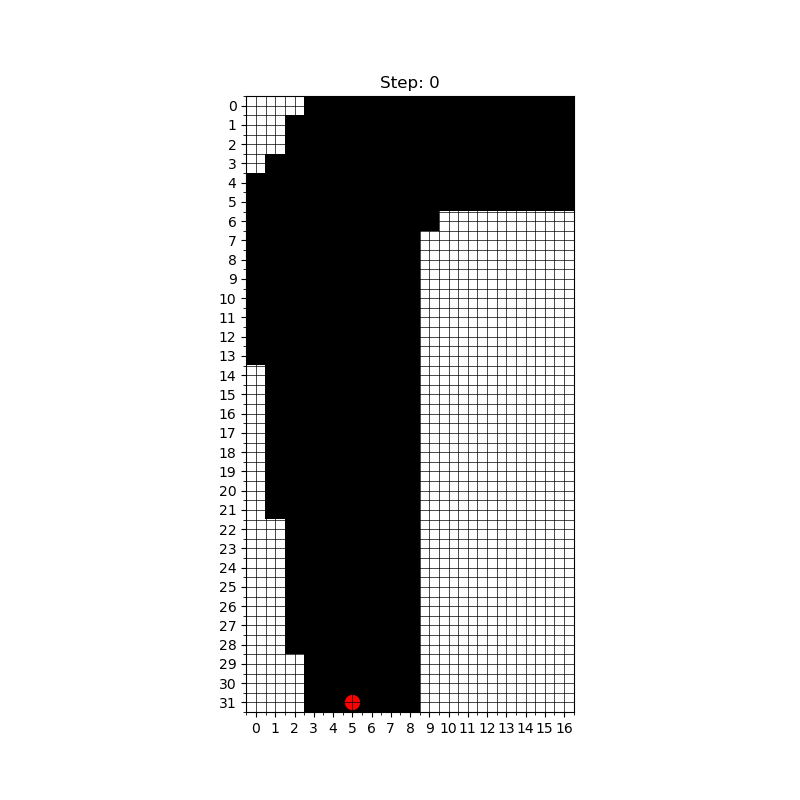
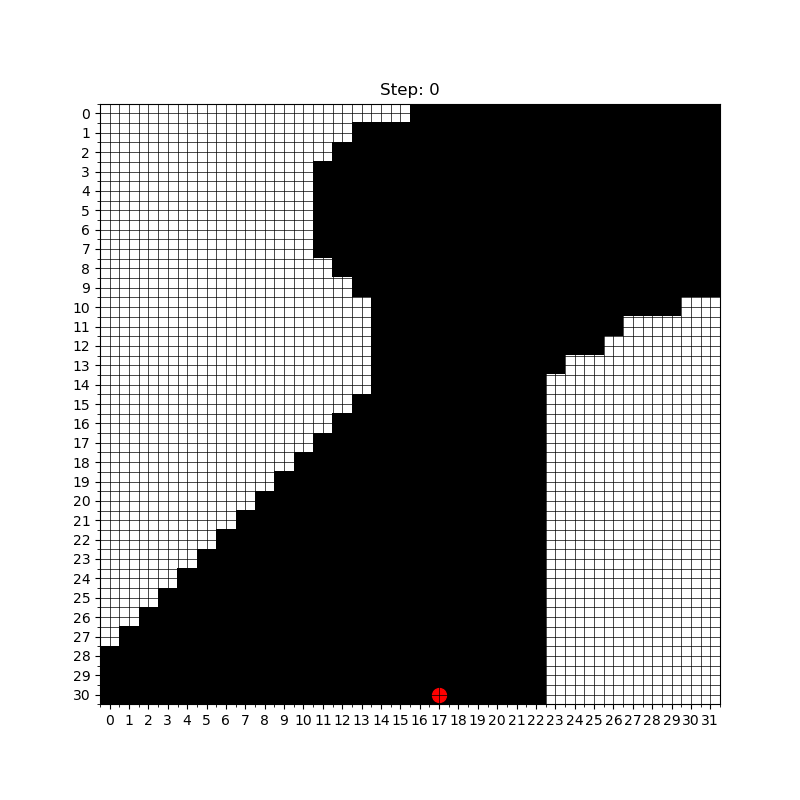

# Monte Carlo Agent Racetrack Simulation

This project implements a Monte Carlo agent to simulate a racing car navigating through a racetrack under challenging conditions like slippage. The goal is to optimize the agent's performance using reinforcement learning techniques.

---

## Problem Overview

Racing through a track with limited control and slippage presents a unique reinforcement learning challenge. The car must navigate the racetrack efficiently while accounting for random slippage and acceleration constraints, learning through trial and error over thousands of simulated episodes.

Key features of the problem:
- **Acceleration Control**: The agent adjusts the car's x and y velocities at each step using discrete accelerations (-1, 0, 1).
- **Slippage**: The car occasionally slips, introducing randomness and difficulty to the task.
- **Custom Tracks**: The environment supports multiple racetrack configurations, allowing flexible experimentation.

---

## Example Behavior

The following examples showcase the agent's performance under various conditions:

1. **Initial Behavior** (Episode 0): The agent begins with no prior knowledge.
   

2. **Slippage Challenges** (Episode 8000): The agent learns to navigate the track despite slippage.
   

3. **Custom Tracks**: Multiple racetracks can be designed and tested.
   

---

## Requirements

To run this project, you will need Python 3.11 or higher and the following dependencies:

### Required Libraries

- `numpy`
- `matplotlib`
- `pandas`
- `imageio`

Install these dependencies using `pip`:

```bash
pip install numpy matplotlib pandas imageio
```

---

## Usage Instructions

### 1. Running the Simulation

1. Open the project in a Jupyter Notebook environment.
2. Adjust the racetrack configuration by updating the `racetrack` object:
   ```python
   racetrack = Racetrack(track_b_coords)
   ```
   Define new racetracks by specifying custom coordinates.
3. Train the Monte Carlo agent using:
   ```python
   train_monte_carlo(agent, driver, num_episodes=5000)
   ```
   For faster training, disable GIF generation by setting `plot_episode=False`:
   ```python
   agent.run_episode(driver, plot_episode=False)
   ```

### 2. Generating GIFs

To visualize the agent's progress, generate GIFs by running a single episode with plotting enabled:

```python
agent.run_episode(driver, plot_episode=True, gif_filename="simulation.gif")
```

This will save a GIF of the episode to the specified file.

### 3. Visualizing Training Results

Use the `plot_training_results` function to analyze performance metrics, such as rolling average rewards and success rates across episodes.

---

## Example Workflow

1. **Training the Agent**:
   ```python
   train_monte_carlo(agent, driver, num_episodes=5000)
   ```

2. **Evaluating Performance**:
   ```python
   evaluate_agent(agent, driver, num_episodes=100)
   ```

3. **Generating a GIF**:
   ```python
   agent.run_episode(driver, plot_episode=True, gif_filename="simulation.gif")
   ```

---

## Notes

- **Improving Speed**: Disable GIF generation during training to speed up the process (`plot_episode=False`).
- **File Management**: Specify unique `gif_filename` values to prevent overwriting previous GIFs.
- **Folder Permissions**: Ensure the output folder for GIFs and intermediate images is writable.
- **Automatic Cleanup**: Intermediate images used in GIF generation are automatically removed.

